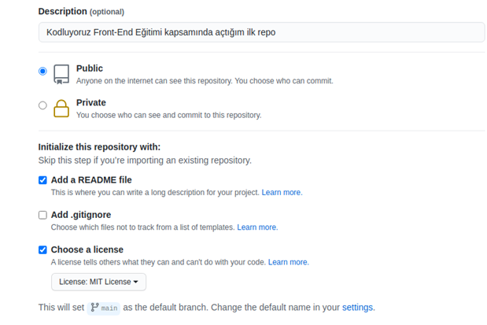

# Kodluyoruz Ilk Repo

Bu repo [Patika.dev](https://www.patika.dev) Git Eğitimi ödevi için oluşturduğum ilk repo. İçerisinde bir adet README dosyası, bir adet de index.html barındırıyor.



## Installation

Öncelikle projeyi clonelayın. (Buraya sizin reponuzdan aldığınız link gelecek)

```bash
git clone https://github.com/selinmorali/kodluyoruzilkrepo.git
```

## Usage

Projeyi cloneladıktan sonra herhangi bir metin editörü ile açınız.

Linux için:

```linux
cd kodluyoruzilkrepo
code .
```

## Contributing

Pull requestler kabul edilir. Büyük değişiklikler için, lütfen önce neyi değiştirmek istediğinizi tartışmak için bir konu açınız.

## License

[MIT](https://choosealicense.com/licenses/mit/)
